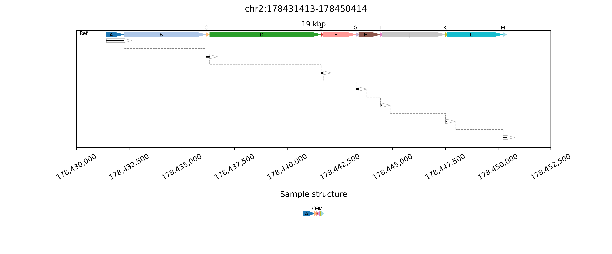
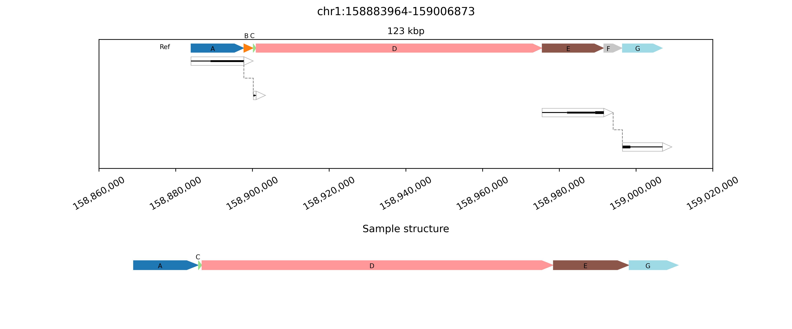

## Result interpretation
`Cnidaria` produces publication-quality PNG images of the genomic blocks altered in structural rearrangements. Genomic breaks are identified relative to the reference genome by identifying clusters of split or clipped alignments. SV plots may include:
* _Reference chain plot_, meaning a chained plot of genomic blocks in the reference genome, shown in reference order and with block transitions at each position with a genomic break in the sample.
* _Spanned blocks_, meaning blocks where reads are aligned to the reference genome. These blocks each have at least one and possibly two clipped ends. The thickness of the lines for the spanned blocks indicates the number of clipped alignments in each position. Spanned blocks are horizontal groups of dark lines inside a black box.
* _Unspanned blocks_, meaning connections between spanned blocks that are directly supported by alignments from the same read in two sequential spanned blocks. Unspanned blocks are dashed lines connecting the end of a spanned block to the end of the next spanned block.
* _Alternate chain plots_, meaning one or more chained plots of genomic blocks in sample order, representing possible alternate haplotype structures. Arrowhead directions indicate alignment orientation relative to the reference genome. Missing blocks represent deletions and repeated blocks indicate duplications. Blocks size is not maintained between this plot and the reference chain plot at the top, but labels and color-coding are used to identify new block positions.

**Simple duplication example image:**

This image is a simple representation of a duplication event. The reference chain plot near the top of the plot contains three distinct blocks labeled `A`, `B`, and `C`, with breaks corresponding to clipped alignment locations found in the BAM file.

The first spanned block in the sample genome contains `A`, `B`, and `C` in reference order as a single block, then a break that is connected via an unspanned block to the start of a second and final spanned block. Each of the spanned blocks occurs in reference orientation as indicated by the arrowheads at the right side.

At the bottom of the plot, a single unambiguous sample chain plot is shown with the blocks from the reference chain plot in their sample order and orientation. This consists of `A>B>C` as shown in the first spanned block, then a direct connection from the end of `B` to the start of `B`, creating a duplication of `B` without altering the reference alignment orientation.

The image was generated from the following JSON data:
```json
   [
    {
      "region": {
        "start_chrom": "chr1",
        "start": 174937531,
        "end_chrom": "chr1",
        "end": 174938005
      },
      "coverages": {
        "chr1:174937531": 1,
        "chr1:174937537": 2,
        "chr1:174938005": 0
      },
      "sample_order_index": 0,
      "orientation": "+"
    },
    {
      "region": {
        "start_chrom": "chr1",
        "start": 174938005,
        "end_chrom": "chr1",
        "end": 174937711
      },
      "coverages": {},
      "sample_order_index": 1,
      "orientation": "-"
    },
    {
      "region": {
        "start_chrom": "chr1",
        "start": 174937711,
        "end_chrom": "chr1",
        "end": 174952891
      },
      "coverages": {
        "chr1:174937711": 2,
        "chr1:174947764": 1,
        "chr1:174952891": 0
      },
      "sample_order_index": 2,
      "orientation": "+"
    }
  ] 
```
## Gallery of examples
**Simple double-deletion**

This example contains two deletion events. Individually they are simple deletions, though their proximity is interesting with A->C->E remaining in the sample while B and D are lost. The extremely small size of region C alters the plotting location for the text label, moving it above the small C block. 

**Inverted double deletion**

This example also contains two deletion events, but in this case the non-deleted region between lost block is also inverted (identifiable from the dashed lines). The inversion is also visible in the arrowhead plot in the `Sample structure` chain plot at the bottom.

**Inverted non-tandem duplication followed by deletion**

In this example, after an initial A->B->C structure, there is a second copy of B in inverted orientation. The second copy is immediately followed by region E, which means the region D between them is omitted. This example thus contains an inverted non-tandem duplication and a deletion.

**Deletion followed by inverted non-tandem duplication and deletion**

Similarly this example contains a deletion and an inverted non-tandem duplication. The order is changed from the previous example as the first rearrangement is the deletion.

**Complex rearrangement with six deletions**

This example shows multiple deletions in a single region, although this time all are directly linked by alignment support. All of the regions that are not missing from this sample remain in reference order and orientation, despite the loss of the six genonomic blocks between them (B, D, F, H, J, and L).

**Complex rearrangement with two deletions connected via phasing**

This example includes two SV events, both deletions. The two events are somewhat distant, but connected by phased reads to identify that both occur on the same haplotype.

The first is a deletion of a region A in the chain sequence A->B->C from the top reference genome. The second is a deletion of a region F in the chain sequence EA->F->G from the top reference genome. Together, the two form a sequence of A->C->D->E->G. The same-haplotype connection is made possible by long HiPhase phase blocks, as the connection between the two deletions is made clear despite a lack of direct alignment evidence linking them.

**Complex rearrangement with multiple deletions and inversions**

Here we see a number of directly connected rearangements, including deletion of region D, inversion and introduction of region E before C, deletion of G, inversion of H, and deletion of I.
