# Result interpretation

## Image components
`svtopo` produces publication-quality images of the genomic blocks altered in structural rearrangements. Genomic breaks are identified relative to the reference genome by identifying clusters of split or clipped alignments. SV plots may include these components:
* _Reference chain plot_, meaning a chained plot of genomic blocks in the reference genome, shown in reference order. Blocks begin at the start of the leftmost chimeric alignment supporting a breakend in the complex SV and transition at each subsequent breakend, culminating at the end of the rightmost chimeric alignment.
* _Spanned blocks_ are blocks where reads are aligned to the reference genome. These blocks are each softclipped at one or both ends. The thickness/weight of the lines for the spanned blocks indicates the number of clipped alignments in each position. Spanned blocks are horizontal groups of dark lines inside a black box. The block weights are not intended to represent the exact number of alignments present, but to give an overview of relative chimeric alignment support across the block.
* _Unspanned blocks_ are dashed lines connecting the end of a spanned block to the end of the next spanned block, with order determined by chimeric alignment order from the originating long read.
* _Alternate chain plots_, one or two chained plots of genomic blocks in sample order, representing possible alternate haplotype structures and shown in context of a second copy of the reference genome structure chain plot. Arrowhead directions indicate alignment orientation relative to the reference genome. Missing blocks represent deletions and repeated blocks indicate duplications. Blocks size is not maintained between this plot and the reference chain plot at the top.
* _Annotation tracks_, visual tracks at the bottom of the window with spanned and unspanned blocks that indicate locations of genes or other genomic freatures relevant to the SV. Multiple BED-format annotation tracks may be shown, and optionally a single gene track (in GTF or GFF3 format) may be added. These may include arrows (`<` or `>`) to show strand/direction of the annotation, and a label plotted below the track.

## Gallery of examples
* [Complex SV example](#complex-sv)
* [Deletion-deletion](#deletion-deletion)
* [Deletion-inversion-deletion](#deletion-inversion-deletion)
* [Deletion-nontandem-duplication](#deletion-nontandem-duplication)
* [Nontandem-duplication-deletion](#nontandem-duplication-deletion)
* [Nontandem-inv-deletion](#nontandem-inv-deletion)
* [Phased-nontandem-inv](#phased-nontandem-inv)
* [Nontandem-inv](#nontandem-inv)
* [Balanced-translocation](#balanced-translocation)
* [Inversion with problematic breakpoint definitions](#inversion-with-problematic-breakpoint-definitions)
* [Incompletely resolved multi-region event](#incompletely-resolved-multi-region-event)

### Complex SV:
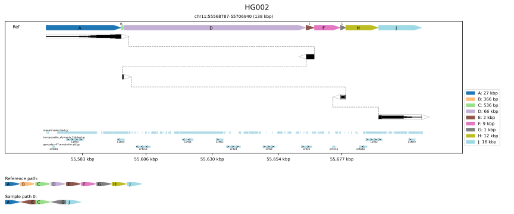

This image is a representation of a complex SV consisting of genomic blocks A-J, where:
* A, C, and J are unchanged
* E and G are inverted
* B, D, F, and H are deleted

The sizes of the blocks are annotated in the legend on the right. The order and orientation of the sample genome relative to the reference are shown by the chain plot at the bottom, where the order of A, E, C, G, and J is shown with arrows indicating inversion of E and G.
Optional gene annotations appear at the bottom of the main plot window, indicating olfactory recepter gene overlaps.

IGV of the same region for comparison, with supplementary alignments linked:

 

### Deletion-deletion

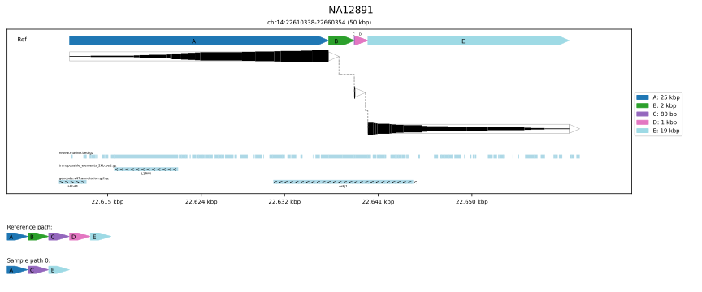

This example contains two deletions B and D, separated by a small (80 bp) conserved region C.

IGV of the same region for comparison, with supplementary alignments linked:
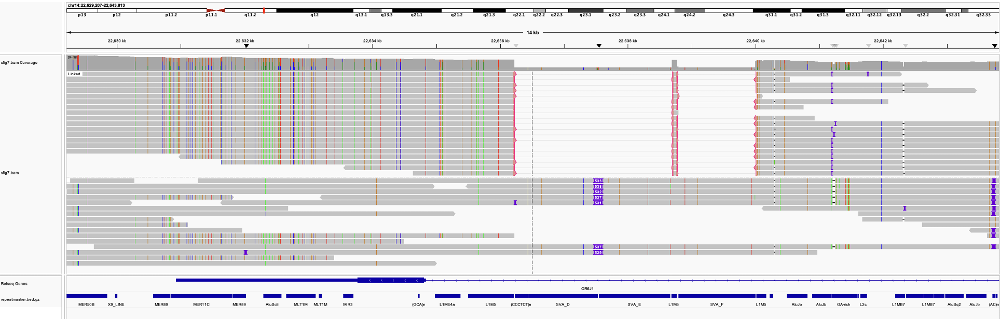

  

### Deletion-inversion-deletion
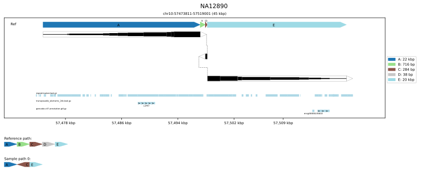

This example also contains two deletion events, but in this case the non-deleted region between them is also inverted (identifiable from the dashed lines). The inversion is also visible in the `Sample structure` chain plot at the bottom.

IGV of the same region for comparison, with supplementary alignments linked:
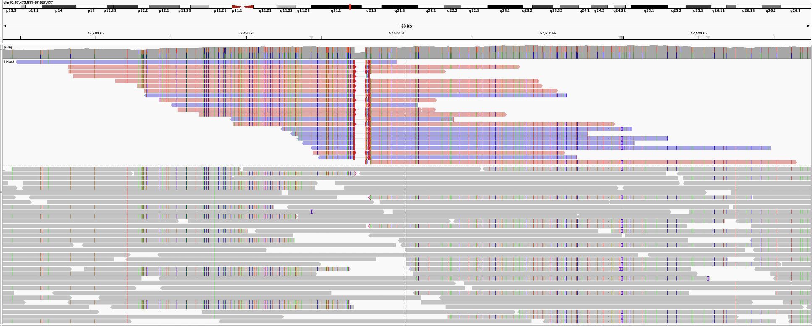

  

### Deletion-nontandem-duplication
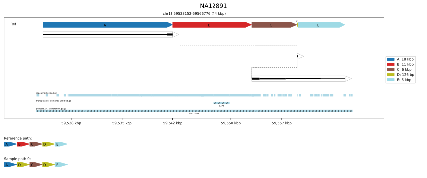

In this example, after an initial A->B->C structure, there is a second copy of B in inverted orientation. The second copy is immediately followed by region E, which means the region D between them is omitted. This example thus contains an inverted non-tandem duplication and a deletion.

IGV of the same region for comparison, with supplementary alignments linked:
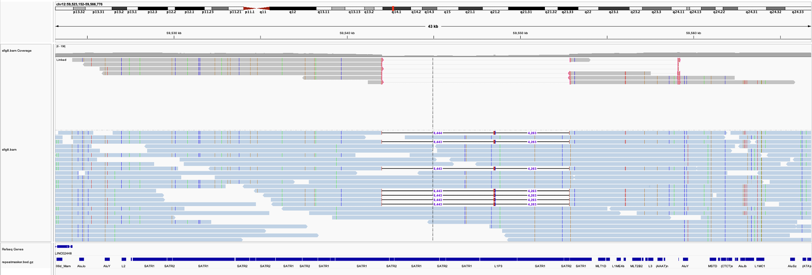

  

### Nontandem-duplication-deletion
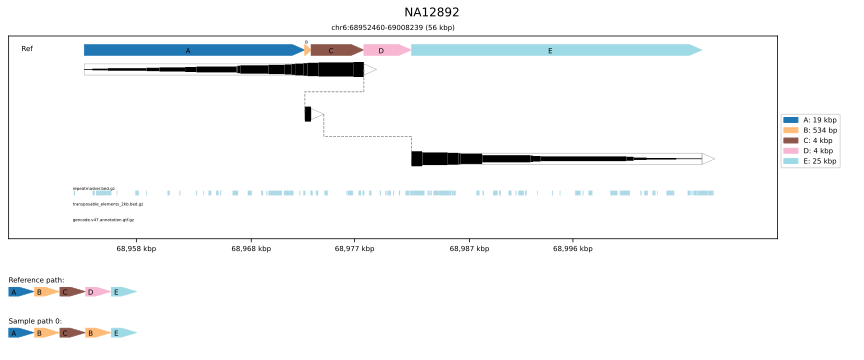

This example contains a non-tandem duplication and a deletion.

IGV of the same region for comparison, with supplementary alignments linked:
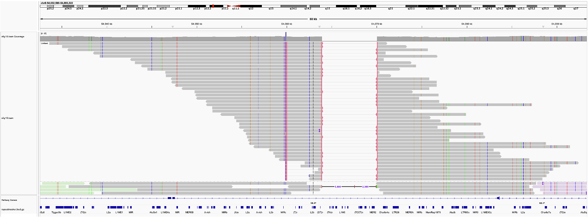

  

### Nontandem-inv-deletion
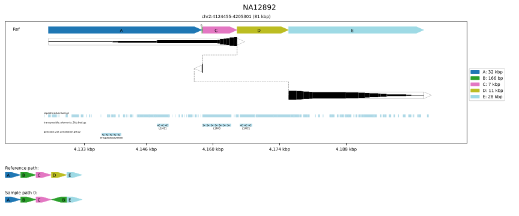

This example contains a non-tandem inversion and a deletion.

IGV of the same region for comparison, with supplementary alignments linked:
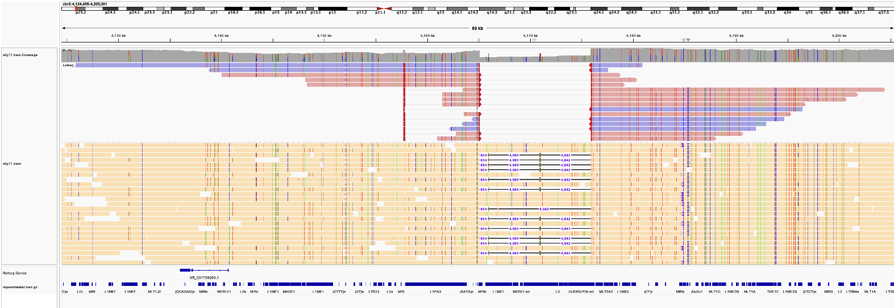

  

### Phased-nontandem-inv
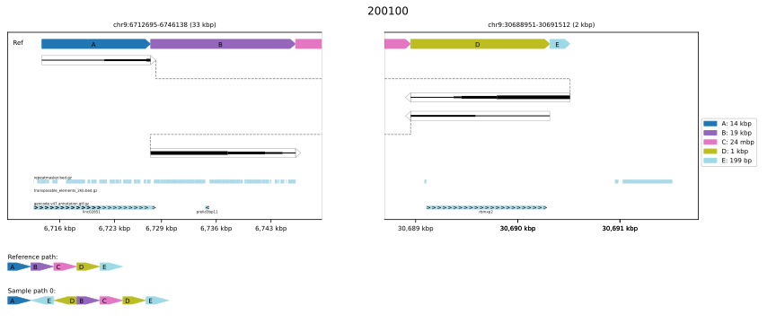

This example contains a non-tandem inversion, re-created via phasing.

IGV of the same region for comparison, with supplementary alignments linked:
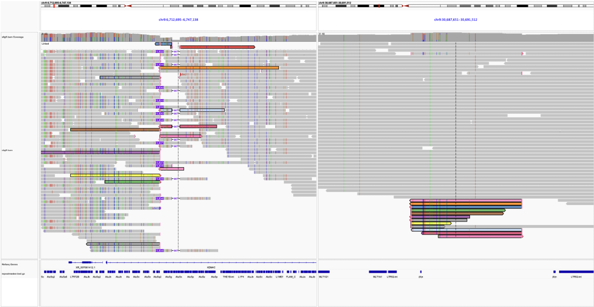

  

### Nontandem-inv
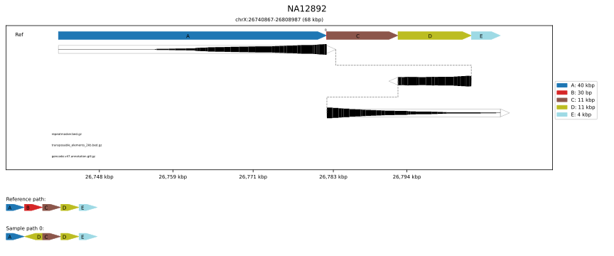

This example contains a non-tandem inversion.

IGV of the same region for comparison, with supplementary alignments linked:
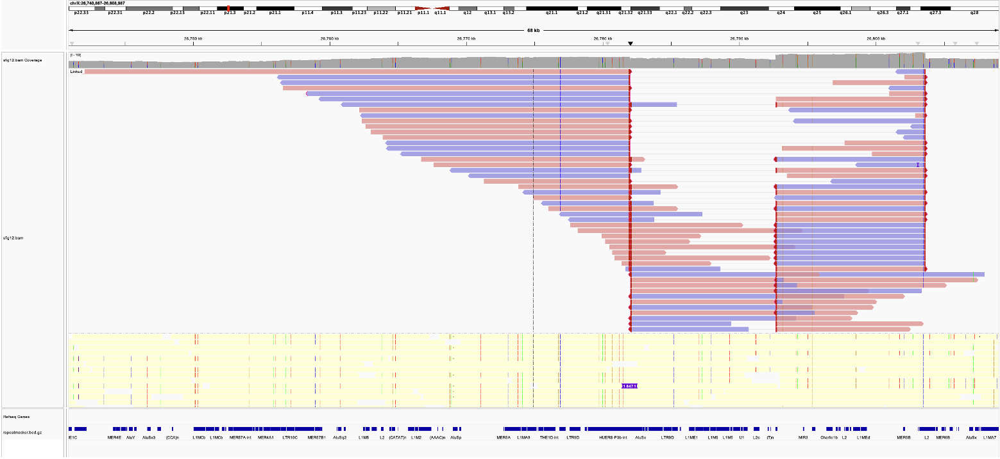

  

### Balanced-translocation
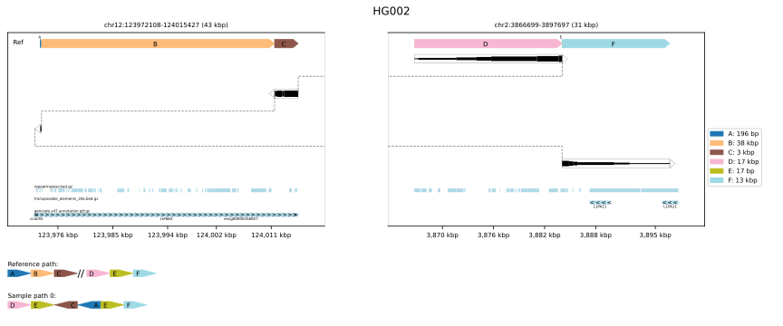

This example shows a translocation of two sequences from Chr12 into chr2. The double line in the `Reference path` chain plot shows the chromosomal transition.

IGV of the same region for comparison, with supplementary alignments linked:
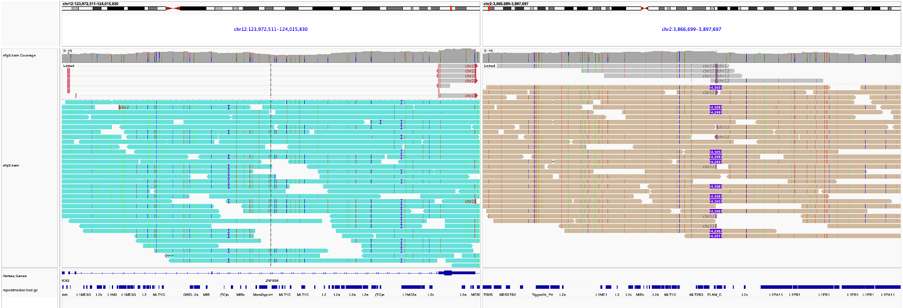

### Inversion with problematic breakpoint definitions
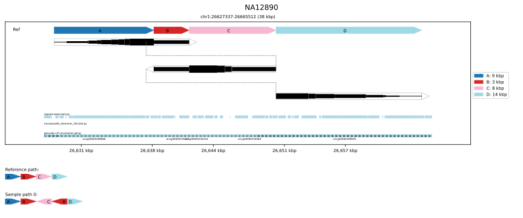

In this inversion case, the clipping locations for the breakpoints were unspecific due to alignment issues. The inversion is clear but presence of a flanking deletion is hard to determine.

IGV of the same region for comparison, with supplementary alignments linked:
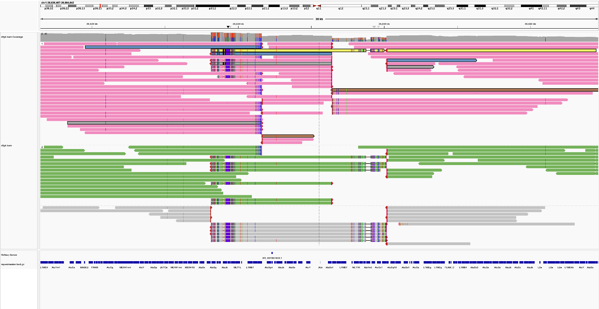

  

### Incompletely resolved multi-region event
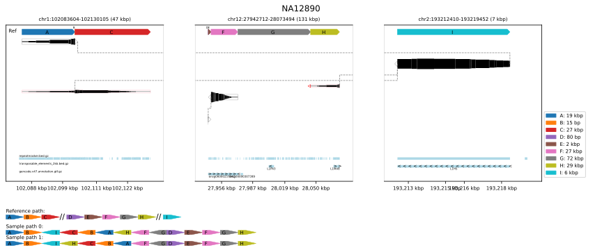

In this case, multiple regions are linked together through multimapping challenges in alignment.

IGV of the same region for comparison, with supplementary alignments linked:
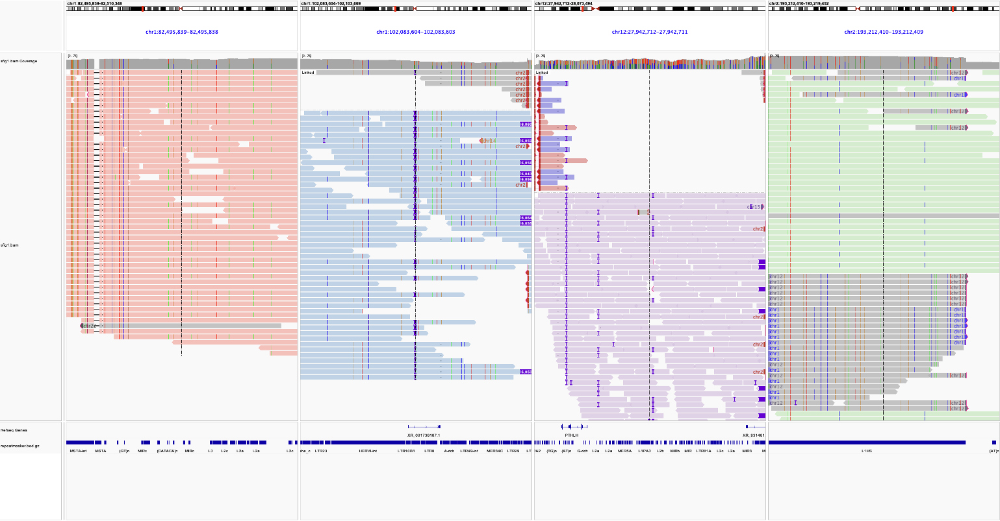

  
