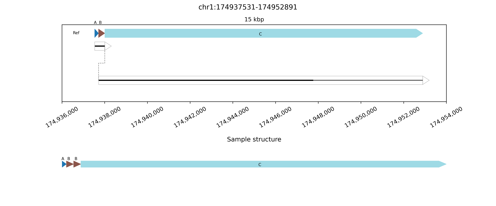

## Result interpretation
Cnidaria produces publication-quality PNG images of the genomic blocks altered in structural rearrangements. Genomic breaks are identified relative to the reference genome by identifying clusters of split or clipped alignments. SV plots may include:
* _Reference chain plot_, meaning a chained plot of genomic blocks in the reference genome, shown in reference order and with block transitions at each position with a genomic break in the sample.
* _Spanned blocks_, meaning blocks where reads are aligned to the reference genome. These blocks each have at least one and possibly two clipped ends. The thickness of the lines for the spanned blocks indicates the number of clipped alignments in each position. Spanned blocks are horizontal groups of dark lines inside a black box, possibly with an arrowhjoead on one end indicating the alignment direction of the block relative to the reference.
* _Unspanned blocks_, meaning connections between spanned blocks that are directly supported by alignments from the same read in two sequential spanned blocks. Unspanned blocks are dashed lines connecting the end of a spanned block to the end of the next spanned block.
* _Sample chain plots_, meaning one or more chained plot of genomic blocks in sample order, with arrowhead directions indication alignment orientation relative to the reference genome. Missing or duplicated blocks are represented here. Blocks size is not maintained between this plot and the reference chain plot at the top, but lettered labels and color-coding are used to identify new block positions.

**Example duplication image:**

This image is a simple representation of a duplication event. The reference chain plot near the top of the plot contains three distinct blocks labeled `A`, `B`, and `C`, with breaks corresponding to clipped alignment locations found in the BAM file. 

The first spanned block in the sample genome contains `A`, `B`, and `C` in reference order as a single block, then a break that is connected via an unspanned block to the start of a second and final spanned block. Each of the spanned blocks occurs in reference orientation as indicated by the arrowheads at the right side.

At the bottom of the plot, a single unambiguous sample chain plot is shown with the blocks from the reference chain plot in their sample order and orientation. This consists of `A>B>C` as shown in the first spanned block, then a direct connection from the end of `C` to the start of `B`, creating a duplication of `B` and `C` without altering their alignment orientation.

The image was generated from the following JSON data:
```json
    {
      "region": {
        "start_chrom": "chr5",
        "start": 141211549,
        "end_chrom": "chr5",
        "end": 141215272
      },
      "coverages": {
        "chr5:141211549": 1,
        "chr5:141211923": 2,
        "chr5:141215272": 0
      },
      "sample_order_index": 4,
      "orientation": "+"
    }
```
