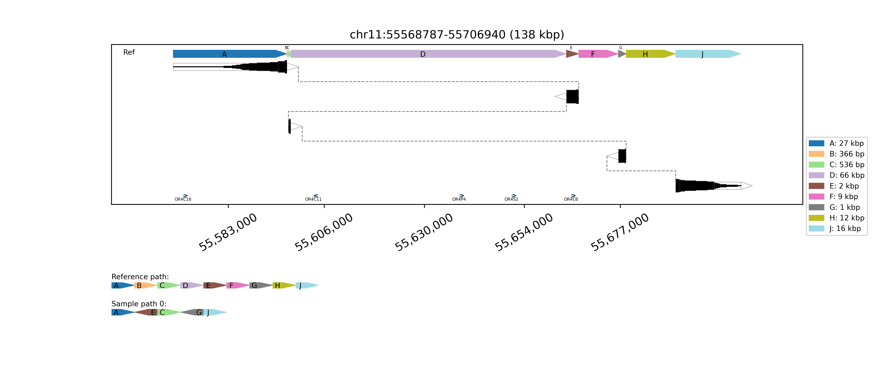
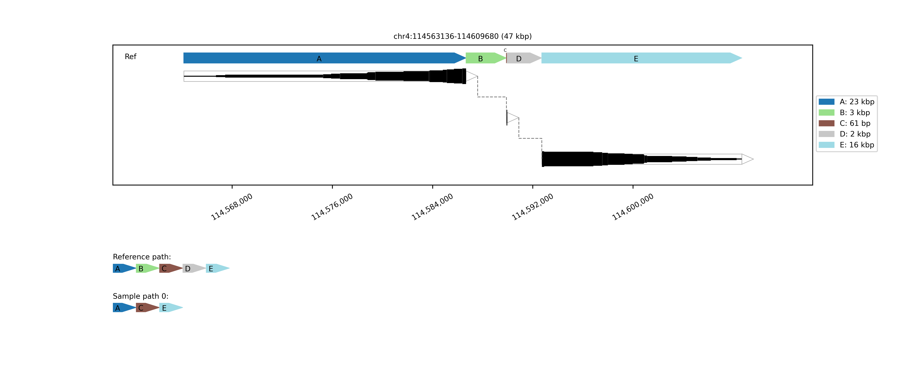
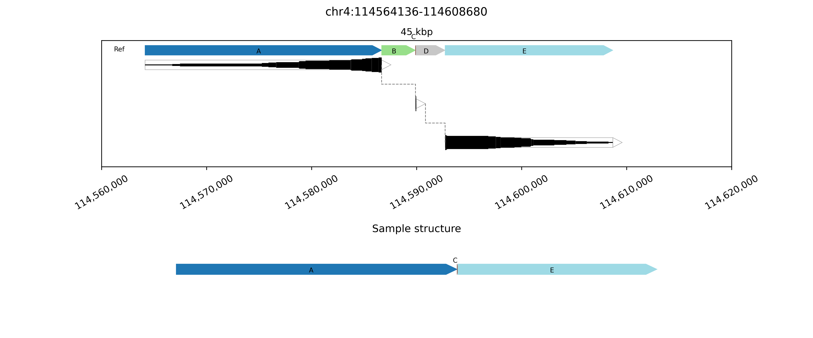
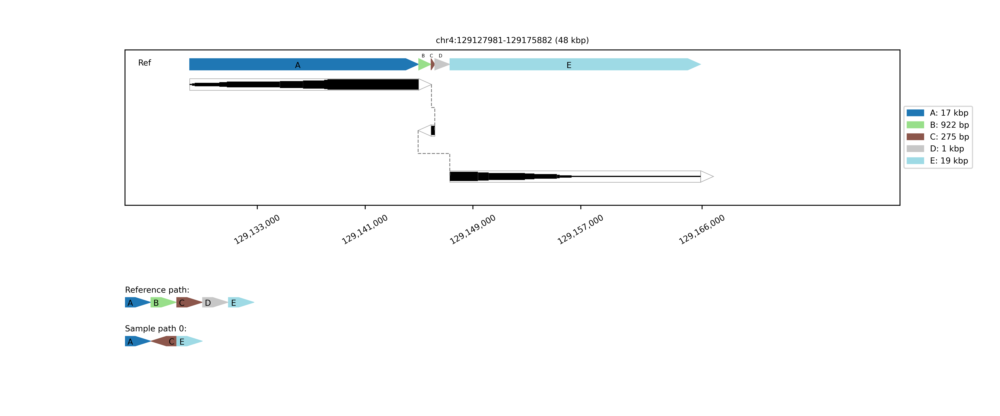
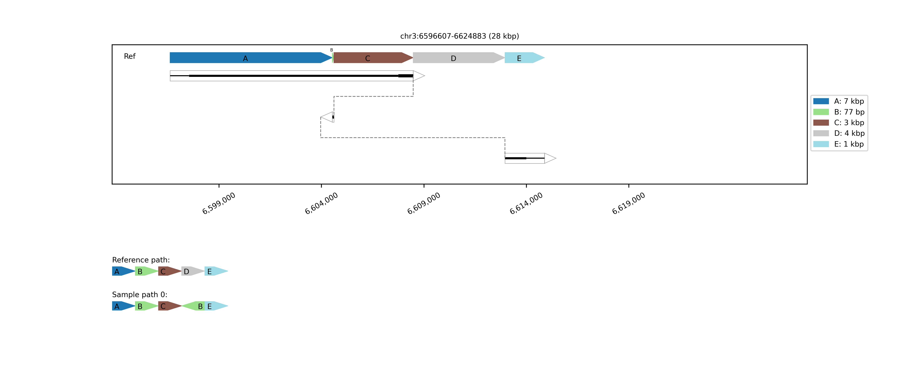
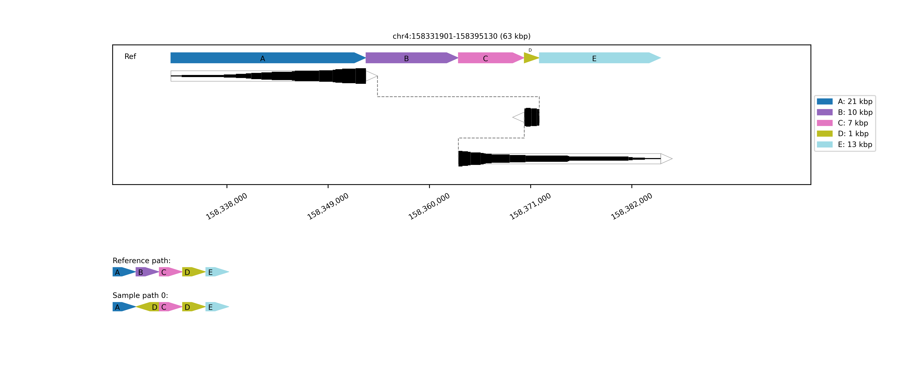
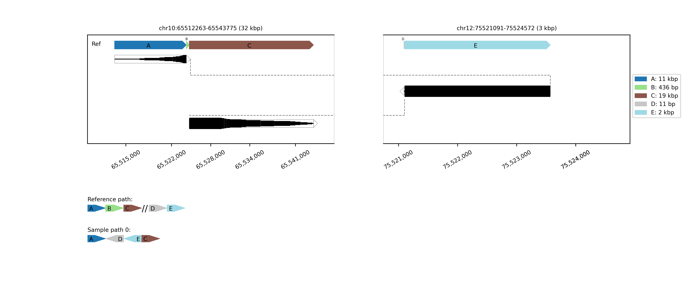

## Result interpretation
`svtopo` produces publication-quality images of the genomic blocks altered in structural rearrangements. Genomic breaks are identified relative to the reference genome by identifying clusters of split or clipped alignments. SV plots may include these components:
* _Reference chain plot_, meaning a chained plot of genomic blocks in the reference genome, shown in reference order. Blocks begin at the start of the leftmost chimeric alignment supporting a breakend in the complex SV and transition at each subsequent breakend, culminating at the end of the rightmost chimeric alignment.
* _Spanned blocks_ are blocks where reads are aligned to the reference genome. These blocks are each softclipped at one or both ends. The thickness/weight of the lines for the spanned blocks indicates the number of clipped alignments in each position. Spanned blocks are horizontal groups of dark lines inside a black box. The block weights are not intended to represent the exact number of alignments present, but to give an overview of relative chiemric alignment support across the block.
* _Unspanned blocks_ are dashed lines connecting the end of a spanned block to the end of the next spanned block, with order determined by chimeric alignment order from the originating long read.
* _Alternate chain plots_, one or two chained plots of genomic blocks in sample order, representing possible alternate haplotype structures and shown in context of a second copy of the reference genome structure chain plot. Arrowhead directions indicate alignment orientation relative to the reference genome. Missing blocks represent deletions and repeated blocks indicate duplications. Blocks size is not maintained between this plot and the reference chain plot at the top.

**Complex SV example:**

This image is a representation of a complex SV consisting of genomic blocks A-J, where:
* A, C, and J are unchanged
* E and G are inverted
* B, D, F, and H are deleted

The sizes of the blocks are annotated in the legend on the right. The order and orientation of the sample genome relative to the reference are shown by the chain plot at the bottom, where the order of A, E, C, G, and J is shown with arrows indicating inversion of E and G.
Optional gene annotations appear at the bottom of the main plot window, indicating olfactory recepter gene overlaps.

## Gallery of examples
**Simple double-deletions**

This example contains two deletions B and D, separated by a small (61 bp) conserved region C.

   

This example contains two deletion events that are farther apart (~75 kbp) but phased to the same haplotype.

   

**Inversion with flanking deletions**

This example also contains two deletion events, but in this case the non-deleted region between them is also inverted (identifiable from the dashed lines). The inversion is also visible in the `Sample structure` chain plot at the bottom.

   

**Inverted non-tandem duplication followed by deletion**

In this example, after an initial A->B->C structure, there is a second copy of B in inverted orientation. The second copy is immediately followed by region E, which means the region D between them is omitted. This example thus contains an inverted non-tandem duplication and a deletion.

   

**Deletion followed by inverted non-tandem duplication and deletion**

Similarly this example contains a deletion and an inverted non-tandem duplication. The order is changed from the previous example as the first rearrangement is the deletion.

   

**Balanced inverted translocation**

This example shows an inverted translocationh of a 3 kbp sequence from chr12 to chr10. The double line in the `Reference path` chain plot shows the chromosomal transition.

   
