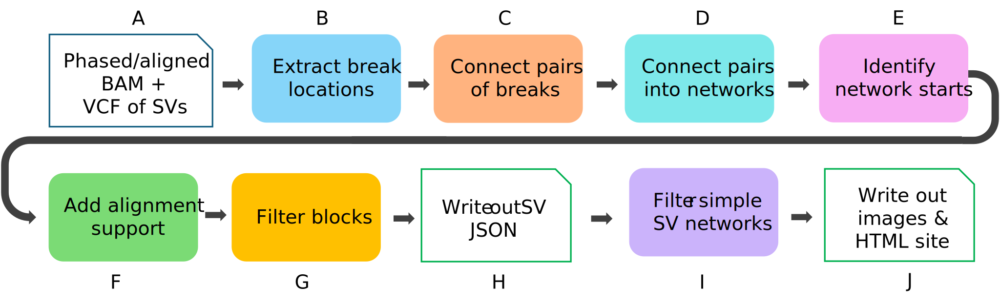

# SVTopo User Guide

## Table of Contents
* [Overview](#overview)
* [Getting Started](#getting-started)
* [Outputs](#outputs)
* [Usage Details](#usage-details)

## Overview

SVTopo creates images to represent chimeric/split alignment evidence for structural variation, with an emphasis on complex variants. For the purposes of SVTopo, these are defined as SVs large enough to for the [pbmm2](https://github.com/PacificBiosciences/pbmm2) aligner to align reads in multiple chimeric alignments, and by default only variants with two or more breakpoints are plotted. Novel insertions are not supported and by default simple deletions and duplications are omitted from results. Complex SVs in SVTopo therefore consist of inversions, translocations, and multi-breakend combinations of simple rearrangements.

### Processing steps:

- A. SVTopo runs on phased and aligned BAM files of long reads together with breakpoint information provided in an SV VCF file.  
- B. Break locations are extracted from SV call coordinates. 
- C. Read alignments and phase blocks are used to connect break locations together, forming pairs of connected breaks. 
- D. Pairs of breaks are further connected into networks of connected break locations, forming full complex SV representations. 
- E. Start breaks are identified for each network of connected break locations, allowing the identification of the correct event order in the sample. 
- F. The number of supporting alignments for each pair of connected breaks in complete SV events is counted and added. 
- G. Filters eliminate regions with abnormal coverage or highly repetitive sequence. 
- H. Results are stored in JSON format, with additional annotations in BED format. 
- I. Simple SV networks, defined as those with only one or two same-chromosome forward-oriented breaks, are filtered out (this optional filter removes the most common deletion and duplication variants). 
- J. Descriptive SV images are generated for complex SV networks, with an HTML website for table-based image browsing. 

## Getting started 

### Installation

<details>
<summary>Expand for installation from Conda or GitHub</summary>
#### Install from Conda
SVTopo (distributed as a Rust binary) and the plotting utility SVTopoVz (Python) are both available from [Bioconda](https://bioconda.github.io/) on Linux. Assuming you have already installed [conda](https://docs.conda.io/projects/conda/en/latest/user-guide/install/linux.html) and [mamba](https://mamba.readthedocs.io/en/latest/), the following example code creates a new environment with python v3.10, activates that environment, and installs both svtopo and svtopovz (as a dependency) into that environment. Note that these mamba commands work the same with conda, but mamba is recommended due to improved execution speed.

```bash
conda config --add channels bioconda
mamba create -n svtopo "python=3.10"
mamba activate svtopo
mamba install -y svtopo
```

The `SVTopo` rust binary is only supported on Linux, but `SVTopoVz` can be installed directly on MacOs:
```bash
conda config --add channels bioconda
mamba create -n svtopo "python=3.10"
mamba activate svtopo
mamba install -y svtopovz
```


#### Install from GitHub

##### SVTopo installation
The `svtopo` Rust utility is available from the [Releases](https://github.com/PacificBiosciences/SVTopo/releases) page.

It can be downloaded, extracted, and run directly on Linux systems. For example with version 0.2.0:
```bash
wget https://github.com/PacificBiosciences/SVTopo/releases/download/v0.1.1/svvtopo_v0.2.0-x86_64-unknown-linux-gnu.tar.gz
tar -zxvf svtopo_v0.1.1-x86_64-unknown-linux-gnu.tar.gz
svtopo --version
```
This will download the `svtopo` binary to the local directory and print out the version number.

The `svtopo` tool can also been installed directly from source by downloading and building the source code directly:
```bash
git clone https://github.com/PacificBiosciences/SVTopo.git
cd SVTopo/
cargo build --release
```
The `svtopo` binary will be created at `SVTopo/target/releases/svtopo`.

##### SVTopoVz installation
The `svtopovz` utility can be downloaded by cloning this reposity with git or by downloading a Source code asset from the [Releases](https://github.com/PacificBiosciences/SVTopo/releases) page.

It can then be installed from source as shown below. It is recommended that this tool be installed in a fresh [Conda](https://conda.io/projects/conda/en/latest/index.html) environment with Python=3.10. 

Install from source, then test that the installation succeeded:
```bash
git clone https://github.com/PacificBiosciences/SVTopo.git
cd SVTopo/SVTopoVz/
conda create -n svtopo "python=3.10"
conda activate svtopo
pip install .
svtopovz -h
```
If successfully installed, this will print out the tool version and command-line options.

### Run tests
For a more complete test of your installation, run the test cases included in the [test/](https://github.com/PacificBiosciences/SVTopo/tree/main/test) directory.
The test script requires the absolute path to your downloaded `svtopo` binary. The following example assumes the binary is located in the `$HOME/bin/` directory:
```bash
cd SVTopo/
bash test/scripts/run_end_to_end_tests.sh $HOME/bin/svtopo_x86_64
```
</details>

### How to run
SVTopo finds and plots SV images in two steps:
1. `svtopo` - Parses the phased BAM, exclude regions BED, and optional sawfish variant call files (VCF and `supporting_reads.json`) to create a complex variant graph representation in JSON format.
2. `svtopovz` - Reads the svtopo output JSON file and uses the complex variant graph information to create plots of the complex variants.

### Example workflow
To plot complex SVs, run SVTopo with an SV caller VCF and the mapped/phased BAM. This will result in a JSON and BED file output in the SVTopo directory, which is given as input to SVTopoVz.

The following example shows how this is done for a sample BAM called `HG002_hg38.bam` with sawfish VCF and `supporting_reads.json` inputs. The sawfish JSON input may be omitted, but contributes significantly to results.

```bash
wget https://github.com/PacificBiosciences/HiFiCNV/raw/refs/heads/main/data/excluded_regions/cnv.excluded_regions.hg38.bed.gz
svtopo\
    --bam HG002_hg38.bam \
    --svtopo-dir my_svtopo_directory/ \
    --prefix sample_name \
    --variant-readnames sawfish_HG002_supporting_reads.json \
    --vcf HG002_sawfish.vcf.gz \
    --exclude-regions cnv.excluded_regions.hg38.bed.gz

svtopovz --svtopo-dir my_svtopo_directory/
```

### Customized annotations
SVTopoVz support customized annotations tracks, often useful for reasoning about SV impacts on the genome and prioritization of variants. 

#### Genes
The `--genes` command line option may be omitted or used to specify one GTF(.gz) or GFF3(.gz) file with gene location information. To minimize overplotting, only `gene` boundaries are plotted in the annotation track. Other features of the annotation file, such as those labeled `codon`, `exon`, `intron`, etc. are omitted. The annotation strand/orientation field information from the annotation file is included in the plotted track, and `gene_name` (or `gene_id` if `gene_name` is not included) is added as a label. 

#### Other annotations
In addition to gene annotations, features such as genomic repeats are often informative. These are accepted by SVTopoVz via the `--annotation-bed` argument, which allows one or more BED(.gz) file paths in a space-delimited list. The input files may contain any number of fields, but must have the standard BED-format `chromosome`, `start`, and `end` fields as indices 0-2. In addition, field 3 may include an annotation label and field 4 may include the +/- character indicating strand. 

The annotation tracks are stacked at the bottom of the main image window and each labeled by input file name. If both gene and BED annotations are provided, the gene track will appear at the bottom and the BED annotations above.

#### Examples: Running SVTopoVz with annotations
Assuming the user has downloaded the RepeatMasker.bed file for Human GRCh38 as repeatmasker.bed from the UCSC Table Browser page, and a GFF3 or GTF gene annotation file from [GENCODE](https://www.gencodegenes.org/human/), the SVTopoVz command from above may be run as follows:
```bash
svtopovz \
    --svtopo-dir my_svtopo_directory/ \
    --genes gencode.v48.basic.annotation.gtf.gz \
    --annotation-bed repeatmasker.bed.gz
```
The above command will result in images that show the genes with name and strand, plus repeatmasker annotations with name only. The strand information is included in the repeatmasker bed file, but some manipulation is required to match the SVTopoVz format expectation.

In the following more advanced example, the LINE1, LINE2, and SVA elements (common human retrotransposons) longer than 2kb are extracted from the repeatmasker BED file, in the expected format for SVTopoVz, prior to invokation of SVTopoVz. This is done by filtering out the repeatmasker `Score` field (column 5).
```bash
zgrep -iE "L1|L2|LINE|SVA" repeatmasker.bed.gz \
    | awk '($3 - $2) >= 2000 { print $1, $2, $3, $4, $6 }' > retrotransposons.bed

svtopovz \
    --svtopo-dir my_svtopo_directory/ \
    --genes gencode.v48.basic.annotation.gtf.gz \
    --annotation-bed repeatmasker.bed.gz retrotransposons.bed
```

For examples of how annotations are displayed, see [Result Interpretation](/docs/result_interpretation.md)


## Outputs
### SVTopo step
The primary output of the SVTopo step is the JSON file detailing the complex SVs found. This may be viewed by the user directly but is not optimized for human readability. A BED file associating regions, variant IDs, and image names is also generated and used in the `SVTopVz` step.

### SVTopoVz step
The SVTopoVz step generates images for each of the entries in the complex SV JSON file that:
* is not a simple deletion or tandem duplication
* can be fully resolved by SVTopoVz into a complex SV graph

For detailed notes on interpretation of these plots, see [result interpretation](https://github.com/PacificBiosciences/SVTopo/blob/main/docs/result_interpretation.md).

In addition to the individual region images, the SVTopoVz step generates a simple HTML web page within the directory identified as `--svtopo-dir`. The web page can be opened in a web browser on a local computer, or can be deployed to a server. The page includes a table viewer with several options for navigation and filtering, allows the user to click a row to view the associated image, and lets the user  save the table to a file. Note the "Show help" checkbox at the bottom bar of the page, which gives more detailed user tips.

## Usage details
<details>
<summary>Compute and algorithm details</summary>

### Expected compute requirements
SVTopo benchmarks with a 30x HiFi genome for three configurations:

__Benchmark with Sawfish VCF + supporting reads:__
* SVTopo
  * Runtime 12:26 (minutes:seconds)
  * 3.0 GB RAM
  * 98% CPU
* SVTopoVz
  * 15 sec
  * 0.52 GB RAM
  * 73 complex SV images

__Benchmark with BAM + VCF (no supporting reads):__
* SVTopo
  * Runtime 12:18 (minutes:seconds)
  * 2.25 GB RAM
  * 98% CPU
* SVTopoVz
  * 8 sec_
  * 0.46 GB RAM_
  * 36 complex SV images

__Benchmark with BAM only:__
* SVTopo
  * Runtime 12:12
  * 2.04 GB RAM
  * 98% CPU
* SVTopoVz
  * 12 sec
  * 0.45 GB RAM
  * 56 complex SV images

  
### Algorithm notes
* Clipped alignments: SVTopo uses chimeric/split alignments to connect structural variants. These are defined as alignments with at least 100 bases of soft-clipping on either end of the alignment. Alignments with MAPQ < 20 are omitted.
* Break identification with sawfish VCF + JSON supporting reads: If a VCF and `supporting_reads.json` are provided from [sawfish](https://github.com/PacificBiosciences/sawfish), these are used to identify additional break locations by using the VCF SV POS and END locations (or POS only for BNDs). INS variants are skipped. The specific alignment from a chimeric read is assigned to a coordinate break location by identifying the closest pair of read clipping coordinate and variant breakend coordinate.
* Break identification with alignments + VCF input (no supporting reads): If a VCF is provided without supporting reads JSON information, the VCF SV locations are still used to define break locations. Assignment of chimeric alignments to break locations is performed by finding matching clipping locations in alignments, where matching is defined as within +/-10bp.
* Break identification without VCF input: We strongly recommend using VCF SV calls, but SVTopo can roughly identify breaks directly from alignments for testing and beginner usage. Locations of genomic breaks are identified using alignment clipping locations that are clustered together. These must be within a 10 bp confidence interval of each other (allowing for small differences of alignment). A minimum of two alignments is required to support a cluster as a potential valid break location.
* Break connections: Once breaks are identified, they can be connected in pairwise fashion by alignments that are shared between them. They may also be connected by using VCF entry connections (via VCF record POS/END). Alignment-based connections must have a minimum of two such shared alignments and must be within 1 mb of each other (if on the same chromosome).
    * Phased connection of clusters: If a breakend lacks direct connections to another breakend via alignments, SVTopo searches for breaks up or down-stream for 500kb and connects them if the reads supporting both breaks have the same phaseset ID and are on the same haplotype.
* Ambiguous sample order: In some cases it may be impossible to determine the order of some genomic blocks. These are given the sample sample_order_index entry in JSON and plotted in images with red outlines instead of the standard dark grey.
* The following filters are applied:
  * Coverage of 300x or less (can be changed using the `max-coverage` option)
  * No more than 5% of reads below MAPQ of 5
</details>